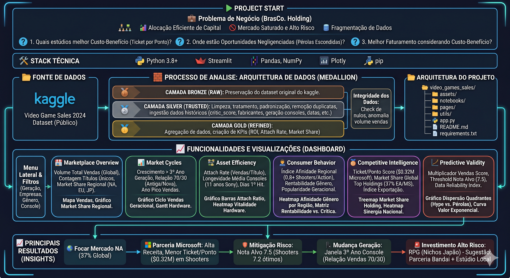
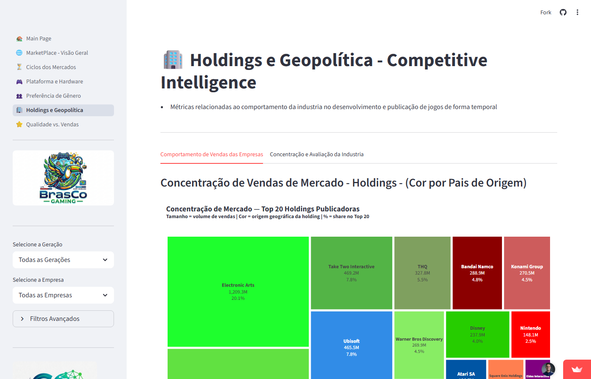
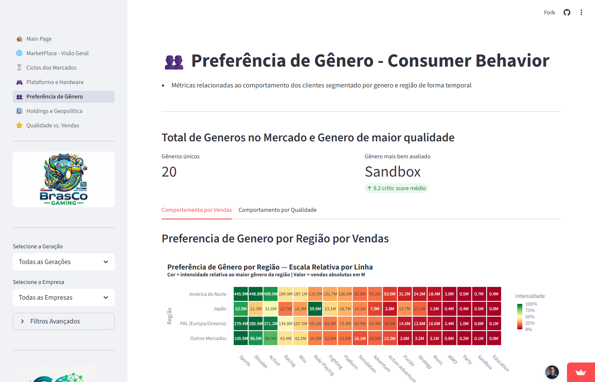
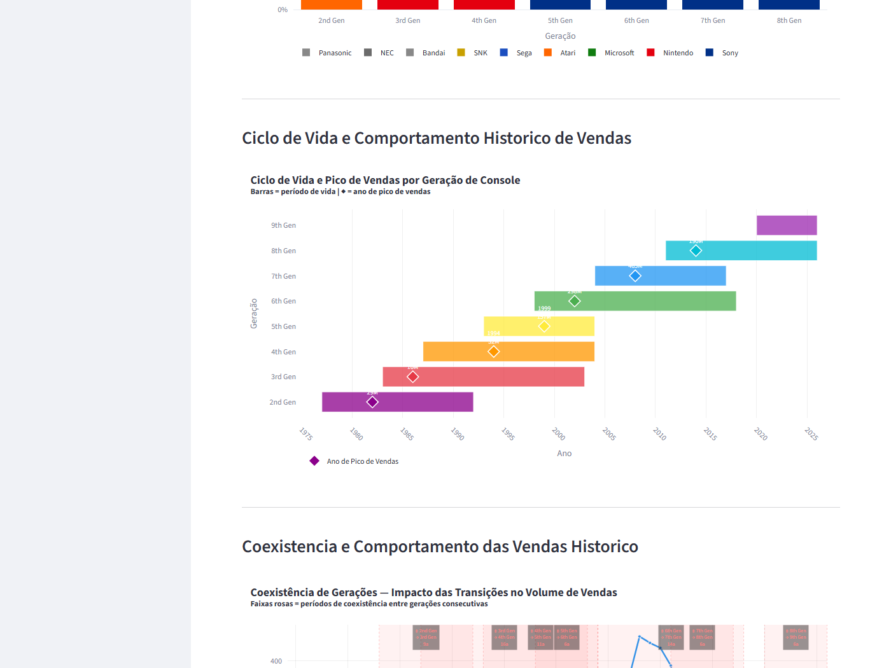
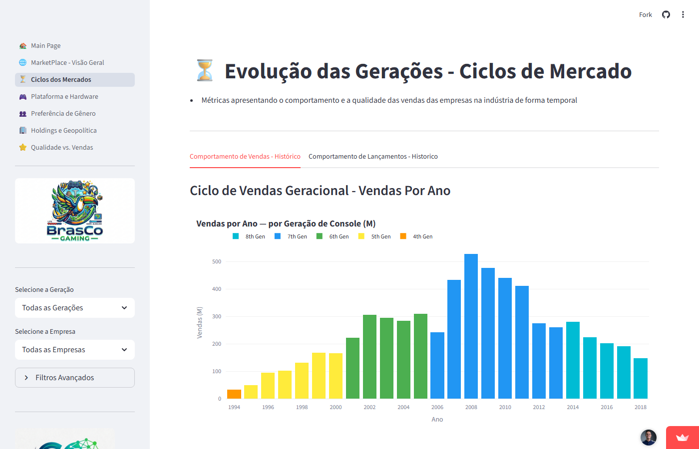

# BrasCo - Gaming Ltd: Visão Estratégica & ROI

⚠️ O app pode levar ~30s para inicializar se estiver inativo.

Link para o projeto: https://brasco-videogames-sales.streamlit.app

<p align="center">

</p>

## 🎯 Problema de Negócio
A BrasCo é uma holding em expansão no setor de entretenimento, enfrenta o desafio de alocar capital de forma eficiente em um mercado de games saturado e de alto risco. O objetivo do projeto é entender o mercado de video games global direcionando o lançamento de novos títulos para o sucesso comercial da empresa.

## 📸 Dashboard

| Competitive Intelligence — Treemap de Market Share | Consumer Behavior — Heatmap de Afinidade de Gênero |
|:---:|:---:|
|  |  |

| Market Cycles — Gantt de Ciclo de Vida de Hardware | Market Cycles — Curva de Vendas por Geração |
|:---:|:---:|
|  |  |

## 🔍 Premissas para Análise
- Quais estúdios apresentam o melhor custo-benefício de desenvolvimento (Ticket por Ponto de Score)?
- Onde estão as oportunidades de mercado negligenciadas pela concorrência (Pérolas Escondidas)?
- Qual melhor oportunidade de faturamento levando em conta o custo-benefício para lançamento de jogos?

## 📈 Estratégias para Solução do Problema

O dashboard está dividido em seis páginas com visões estratégicas do mercado em relação a empresas, consoles e consumidores. Todas as páginas são acessíveis pelo menu lateral e os gráficos são interativos, podendo ser filtrados pela geração dos consoles e as principais empresas do mercado, além de um filtro avançado.

1. **Marketplace Overview**
- Focada em métricas de volume total do mercado e dominância geográfica.
- Métricas Chave (KPIs): Volume Total de Vendas (Global), Contagem de Títulos Únicos e Market Share por Região (NA, EU, JP).
- Gráficos: Mapa de Distribuição de Vendas por País e Gráfico de Market Share Regional.

2. **Market Cycles**
- Focada em métricas de evolução temporal das vendas e comportamento das gerações de consoles.
- Métricas Chave: Crescimento de 123% nas vendas a partir do 3º ano da geração, Relação de Transição 70/30 (Antiga/Nova) e Ano de Pico de Vendas.
- Gráficos: Gráfico de Linhas de Ciclo de Vendas Geracional e Gráfico de Gantt de Ciclo de Vida de Hardware.

3. **Asset Efficiency**
- Focada em métricas de eficiência de conversão de hardware em software e longevidade de plataformas.
- Métricas Chave: Attach Rate (Vendas por Título), Longevidade Média de Consoles (11 anos para Sony) e Dias até o Primeiro Hit.
- Gráficos: Gráfico de Barras de Attach Ratio por Console e Heatmap de Vitalidade de Hardware.

4. **Consumer Behavior**
- Focada em métricas de afinidade cultural por gêneros e rentabilidade por tipo de jogo.
- Métricas Chave: Índice de Afinidade Regional (0.8+ para Shooters/Action), Rentabilidade por Gênero e Popularidade Geracional.
- Gráficos: Heatmap de Afinidade de Gênero por Região e Matriz de Rentabilidade vs. Recepção Crítica.

5. **Competitive Intelligence**
- Focada em métricas de performance comparativa entre Holdings e influência geopolítica na publicação.
- Métricas Chave: Ticket por Ponto de Score ($0.32M para Microsoft), Market Share Global das Top Holdings (37% EA/MS) e Índice de Exportação.
- Gráficos: Treemap de Market Share por Holding e Heatmap de Sinergia Nacional (Desenvolvedor x Distribuidor).

6. **Predictive Validity**
- Focada em métricas de correlação entre qualidade (Score) e retorno financeiro para mitigação de risco.
- Métricas Chave: Multiplicador de Vendas por Score, Threshold de Nota Alvo (8) e Index do Critic_Score.
- Gráficos: Gráfico de Dispersão com Quadrantes (Hype vs. Pérolas Escondidas), Nota Ótima de Aumento de Vendas.

7. **Launch Recommendation**
- Síntese executiva que combina as 6 dimensões de análise em um score composto por gênero.
- Métricas Chave: Score de Oportunidade (0–100), Score de Risco (0–100), Melhor Plataforma por Gênero e Nota Mínima Sugerida.
- Gráficos: Ranking Horizontal de Oportunidade vs Risco (barras + marcadores) e Tabela de Sub-métricas por Gênero.

## 📈 Principais Resultados
Os insights trazidos por esse painel de KPIs de negócio respondem as perguntas acima:

**Mercado & Geração:**
- Direcionar os esforços para o mercado da América do Norte (NA) garantindo o acesso a 37% do mercado global
- Ficar atento com a mudança de geração: a janela de oportunidade começa a partir do 3º ano do console, quando a relação de vendas atinge 70/30 (Antiga/Nova), permitindo migrar investimentos em novos títulos com segurança

**Gênero & Parceria:**
- Associação com a Microsoft Corporation garante maior receita com menor exigência no Ticket por Ponto de Score ($0.32M), focando no desenvolvimento do gênero **Shooter** — melhor relação entre Média da Crítica vs. Média de Vendas
- Para mitigação de risco, construir títulos com **nota alvo ≥ 7.5** (Shooters performam bem a partir de 7.2)

**Síntese — Launch Recommendation (Página 7):**
- O score composto de **Oportunidade** (40% volume de vendas + 30% alcance geográfico + 30% multiplicador de crítica) e **Risco** (40% concentração regional + 30% sensibilidade de vendas + 30% saturação de mercado) confirma o **Shooter como melhor aposta histórica**: alta média de vendas, amplo alcance geográfico e forte multiplicador de crítica
- **RPG: investimento de alto risco** 🚨 — boa avaliação crítica, mas vendas altamente concentradas no Japão, o que eleva o score de risco. Requer parceria com a Bandai e estúdio local para viabilizar apelo regional
- A visão por geração revela que a última geração de consoles apresenta reconfiguração de gêneros líderes, sendo Sports e Racing os que mais crescem em penetração — oportunidade de diversificação de portfólio

## 👩‍💻 Conclusão
O objetivo desse projeto é criar um conjunto de gráficos e/ou tabelas para exibir as métricas ao CEO da melhor forma possível. Os resultados demonstram que, baseado na análise histórica de mercado, o foco deve ser na **América do Norte** (37% do market share) em parceria com a **Microsoft Corporation** para otimizar a receita com baixo custo por ponto de score ($0,32M), desenvolvendo títulos do gênero **Shooter** e observando o 3º ano da geração de novos consoles — ponto em que a curva de vendas começa a migrar para a nova plataforma.

A página de síntese **Launch Recommendation** (Página 7) consolida todas as seis dimensões de análise em um único score de oportunidade e risco por gênero. O modelo quantifica, de forma reproduzível, qual gênero maximiza retorno com menor exposição ao risco regional e à saturação de mercado, transformando seis painéis de análise em uma recomendação de lançamento acionável e baseada em evidências históricas.

## 🛠️ Stack Técnica
As seguintes ferramentas e bibliotecas foram utilizadas no desenvolvimento deste projeto:
- Linguagem: Python 3.8+
- Framework Web: Streamlit
- Manipulação de Dados: Pandas, NumPy
- Visualização de Dados: Plotly
- Gerenciamento de Ambiente: pip

### 📂 Fonte de Dados
Os dados utilizados são públicos e foram coletados via Kaggle:

https://www.kaggle.com/datasets/asaniczka/video-game-sales-2024

### 🧱 Processo de Análise: Arquitetura de Dados (Medallion Architecture)
Para garantir a confiabilidade, implementei uma lógica de processamento em camadas, otimizada em Python:
- 🥉 **Camada Bronze (Raw)**: Preservação do dataset original do Kaggle.
- 🥈 **Camada Silver (Trusted)**: Processo intensivo de limpeza, tratamento e padronização de nomes de holdings, remoção de duplicatas e ingestão de dados históricos dentre os principais a classificação Premium (>= 9) usando o critic_score, fabricantes, geração dos consoles, anos de atividade do console, data de lançamentos dos consoles e países de developers e publishers.
- 🥇 **Camada Gold (Refined)**: Agregação de dados para criação dos KPIs de negócio (ROI, Attach Rate, Market Share) prontos para consumo no Dashboard.

### 🔍 Integridade dos Dados
A integridade dos dados foi conferida por:
- Verificação de valores nulos
- Anomalias de volume nas vendas (total_sales, na_sales, jp_sales, pal_sales, other_sales)

### 📂 Arquitetura do Projeto
### A estrutura do repositório está organizada da seguinte forma:

```text
video_games_sales/
├── assets/             # Imagens e recursos visuais utilizados no README e os dados brutos video_game_sales.csv e dataset_limpeza.
├── notebooks           # Jupyter Notebook com o código da limpeza de dados e enriquecimento de informações do dataset
├── pages/              # Páginas secundárias do dashboard Streamlit
├── utils/              # Funções relacionadas a limpeza de dados e carregamento do sidebar com os filtros como funções úteis
├── .gitignore          # Arquivos e pastas a serem ignorados pelo Git.
├── app.py              # Arquivo principal que renderiza a página inicial do dashboard com as principais instruções.
├── LICENSE             # Licença MIT do projeto.
├── README.md           # Documentação principal do projeto.
└── requirements.txt    # Lista de bibliotecas Python necessárias.
```

## 👩‍💻 Autor
 Desenvolvido por Guilherme Grandim como um projeto de portfólio em Ciências/Análise de Dados</br>
 Sinta-se à vontade para entrar em contato ou contribuir com o projeto!
 Linkedin:[ℹ️](https://www.linkedin.com/in/guilherme-grandim/)
 Gmail: [📧](mailto:gui.grandim@gmail.com)

